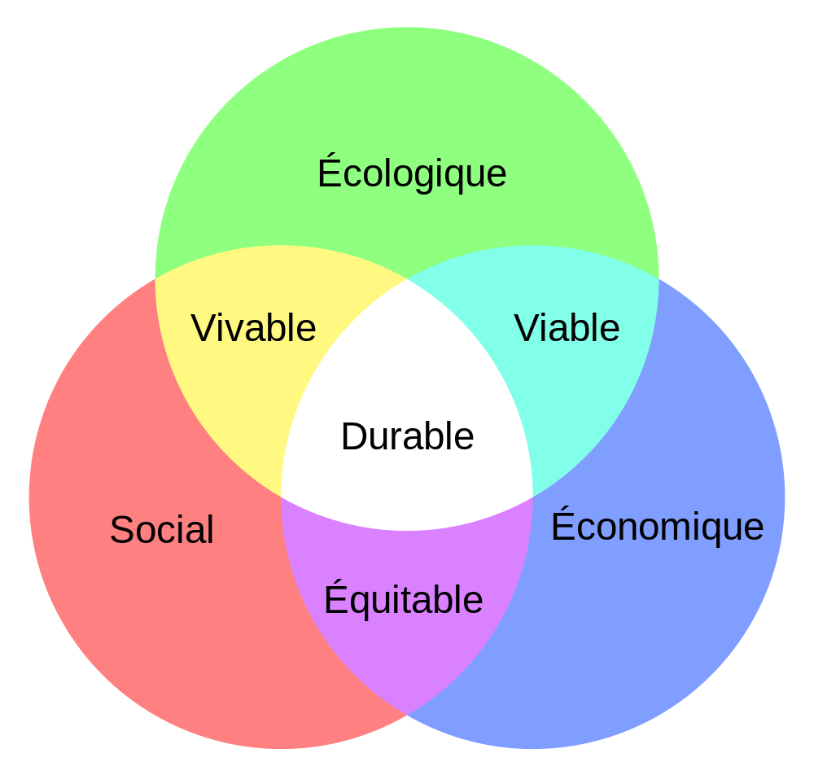
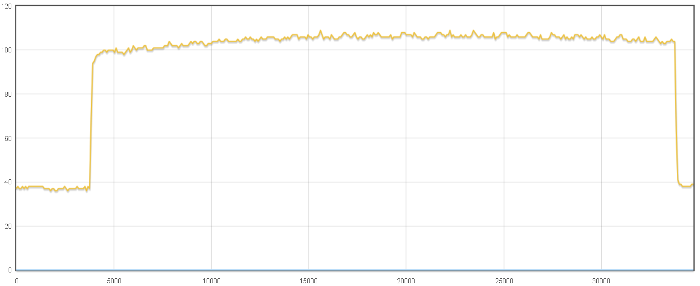

% Introduction au Green IT logiciel
% David Sferruzza
% Human Talks 11/03/2014

### À propos de moi

- [\@d_sferruzza](https://twitter.com/d\_sferruzza)
- [github.com/dsferruzza](https://github.com/dsferruzza)
- ingénieur Icam
- 5 mois sur le projet Code Vert

# Le Green IT

## Qu'est ce que c'est ?

Proposition de définition :

> Démarche d’amélioration continue qui vise à réduire l’empreinte écologique, économique et sociale des technologies de l’information et de la communication.

## Qu'est ce que c'est ?

## À quoi ça sert ?

Consommer moins d'énergie implique :

- consommer moins de ressources naturelles
- moins polluer
- réduire les coûts

# Réduire l'empreinte énergétique d'un programme

## Que peut-on optimiser ?

## Approche matérielle

Agir sur le matériel qui fait fonctionner les programmes.

Exemples :

- réduire le dégagement de chaleur d'un processeur
- réduire le coût énergétique de la fabrication d'un disque dur

### Avantages/inconvénients

- possible d'obtenir un gain important
- difficile d'accès pour le développeur

## Approche logicielle

Agir directement sur les programmes.

Exemples :

- supprimer des opérations inutiles
- réduire la configuration matérielle minimum requise

### Avantages/inconvénients

- à la portée du développeur
- gain à priori moins important (mais pas forcément non significatif)

## Mesure du gain

Soient :

- **A**, un programme
- **B**, une version optimisée de A

. . .

Pour savoir si l'optimisation est concluante, il faut :

- choisir des **indicateurs**
- mesurer un **gain**

. . .

> $gain = \frac{indicateur_{B}}{indicateur_{A}}$

## Indicateurs

Un bon indicateur (observable) est en **corrélation** avec la grandeur qu'on souhaite connaitre.

À lire : http://ploum.net/mefiez-vous-des-observables/

## Indicateurs

Exemple : surconsommation énergétique provoquée par l'exécution du programme

- en Joule
- obtenu par mesure physique 

## Indicateurs

Exemple : maximum de la mémoire vive occupée

- en octet
- obtenu par mesure logique

# Exemple d'expérience

## Hypothèse

## Plan d'expérience

## Programmes de test

## Mesures

## Analyse

# Conclusion

## Conclusion

- optimiser pour la conso $\simeq$ optimiser pour les perfs
- bientôt plus besoin de mesures physiques ?

. . .

De manière générale :

- prendre en compte **l'ensemble** du cycle
- choisir de **bons indicateurs** par rapport à ce qu'on veut mesurer
- **reproduire** l'expérience
- faire **varier** les paramètres d'environnement
