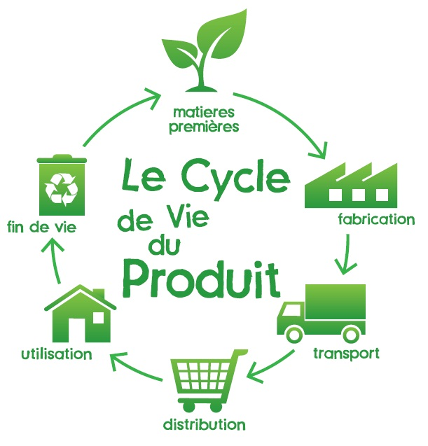

% Introduction au Green IT logiciel
% David Sferruzza
% Human Talks 11/03/2014

### À propos de moi

- [\@d_sferruzza](https://twitter.com/d\_sferruzza)
- [github.com/dsferruzza](https://github.com/dsferruzza)
- ingénieur Icam
- 5 mois sur le projet Code Vert

# Le Green IT

## Qu'est ce que c'est ?

Proposition de définition :

> Démarche d’amélioration continue qui vise à réduire l’empreinte écologique, économique et sociale des technologies de l’information et de la communication.

## Qu'est ce que c'est ?


## À quoi ça sert ?

Consommer moins d'énergie implique :

- consommer moins de ressources naturelles
- moins polluer
- réduire les coûts

# Réduire l'empreinte énergétique d'un programme

## Que peut-on optimiser ?



## Approche matérielle

Agir sur le matériel qui fait fonctionner les programmes.

Exemples :

- réduire le dégagement de chaleur d'un processeur
- réduire le coût énergétique de la fabrication d'un disque dur

### Avantages/inconvénients

- possible d'obtenir un gain important
- difficile d'accès pour le développeur

## Approche logicielle

Agir directement sur les programmes.

Exemples :

- supprimer des opérations inutiles
- réduire la configuration matérielle minimum requise

### Avantages/inconvénients

- à la portée du développeur
- gain à priori moins important (mais pas forcément non significatif)

## Mesure du gain

Soient :

- **A**, un programme
- **B**, une version optimisée de A

. . .

Pour savoir si l'optimisation est concluante, il faut :

- choisir des **indicateurs**
- mesurer un **gain**

. . .

> $gain = \frac{indicateur_{B}}{indicateur_{A}}$

## Indicateurs

Un bon indicateur (observable) est en **corrélation** avec la grandeur qu'on souhaite connaitre.

À lire : http://ploum.net/mefiez-vous-des-observables/

## Indicateurs

Exemple : surconsommation énergétique provoquée par l'exécution du programme

- en Joule
- obtenu par mesure physique 


## Indicateurs

Exemple : maximum de la mémoire vive occupée

- en octet
- obtenu par mesure logique

# Exemple d'expérience

## Hypothèse

On veut vérifier l'hypothèse suivante :

> En Java, il vaut mieux initialiser les variables de manière littérale plutôt qu'avec un objet.

## Plan d'expérience

On mesure la *surconsommation énergétique* provoquée par l'exécution de 2 programmes de **fonction(s) identique(s)**.

Matériel :

- un ordinateur d'essai dont l'alimentation est monitorée
- un ordinateur d'acquisition

Déroulement de la mesure :

1. lancement de la mesure
2. attente de X secondes
3. lancement de la perturbation (programme sur l'ordinateur d'essai)
4. fin de la perturbation
5. attente de Y secondes
6. fin de la mesure

## Programmes de test

**Hypothèse :** les techniques de micro-benchmarking permettent d'obtenir un résultat pertinent

### Code "vert"

```java
for (int i = 0; i < 1000; i++) {
	array[i] = "abcdefg...";
}
```

### Code "gris"

```java
for (int i = 0; i < 1000; i++) {
	array[i] = new String("abcdefg...");
}
```

## Mesures


## Analyse

\begin{tabular}{|l|r|r|r|}
	\hline
	Variante & Énergie code vert & Énergie code gris & Gain \\
	\hline
	\hline
	String & 697 J \footnotesize{($\pm$ 4,40 \%)} & 7885 J \footnotesize{($\pm$ 8,14 \%)} & 11,3 \\
	\hline
	Integer & 685 J \footnotesize{($\pm$ 5,21 \%)} & 9575 J \footnotesize{($\pm$ 6,51 \%)} & 14,0 \\
	\hline
	Float & 10311 J \footnotesize{($\pm$ 5,85 \%)} & 10448 J \footnotesize{($\pm$ 6,58 \%)} & 1,0 \\
	\hline
	Double & 10003 J \footnotesize{($\pm$ 5,58 \%)} & 10210 J \footnotesize{($\pm$ 7,83 \%)} & 1,0 \\
	\hline
\end{tabular}

Avec cet indicateur : gain significatif avec certains types mais pas tous !

Pour aller plus loin :

- reproduire dans des conditions/environnements différents
- reproduire avec des programmes différents
- regarder d'autres indicateurs

# Conclusion

## Conclusion

- optimiser pour la conso $\simeq$ optimiser pour les perfs
- bientôt plus besoin de mesures physiques ?

. . .

De manière générale :

- prendre en compte **l'ensemble** du cycle
- choisir de **bons indicateurs** par rapport à ce qu'on veut mesurer
- **reproduire** l'expérience
- faire **varier** les paramètres d'environnement

## Bisous

*Merci à Jérôme Rocheteau*

\Huge{Questions ?}
